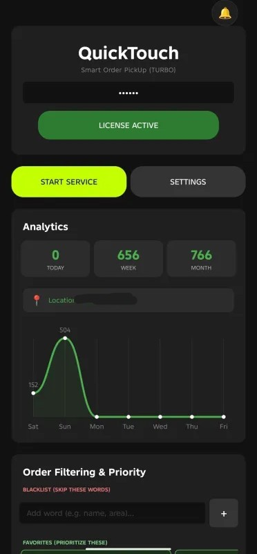

# QuickTouch — Smart Order PickUp

QuickTouch is a high-performance order picking assistant designed specifically for **Chowdeck Riders** in Nigeria. It automates the order acceptance process, allowing riders to pick orders in as little as **50ms**.



## ⚡ Features

- **Lightning Fast Pickup:** Accept orders in 50ms (Gold Tier) or 150ms (Standard Tier).
- **Location-Smart Filtering:** Prioritizes restaurants nearest to your GPS location.
- **Favorite Restaurants:** (Bicycle mode) Set preferred spots for priority picking.
- **Package Filtering:** Automatically skips package-only orders to keep your workflow efficient.
- **Order Analytics:** Track your daily, weekly, and monthly pick counts directly in the app.

## 🛠 Tech Stack

- **Frontend:** [Vite](https://vitejs.dev/) + [TypeScript](https://www.typescriptlang.org/)
- **Package Manager:** [Bun](https://bun.sh/)
- **Styling:** Vanilla CSS (Custom UI kit)

## 🚀 Getting Started

### Prerequisites

You will need [Bun](https://bun.sh/) installed on your machine.

### Installation

Clone the repository and install dependencies:

```bash
git clone https://github.com/CHToken/QuickTouch_Frontend.git
cd QuickTouch_Frontend
bun install
```

### Development

Start the development server with Hot Module Replacement (HMR):

```bash
bun run dev
```

### Build

Create an optimized production build:

```bash
bun run build
```

The output will be in the `dist/` directory.

## 📱 Requirements

- Android 11 or above.
- Active Chowdeck Rider account.
- Active QuickTouch License Key.

## 📄 License & Contact

Built by **TechyTro Software**. For support or activation keys, contact us via the links provided on the [QuickTouch Website](https://quicktouchchowdeck.netlify.app).

---
© 2026 QuickTouch by TechyTro Software. Built for the hustle.
